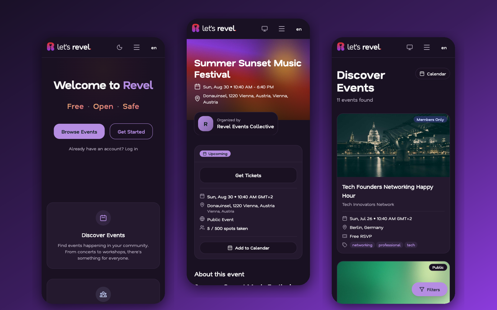

# Revel frontend

**Revel is an open-source event management, ticketing and membership platform for communities, clubs, independent venues and independent artists.**

[](./LICENSE)
[](https://discord.gg/Rnwbzuvxvn)
[](https://github.com/letsrevel/revel-frontend/actions/workflows/ci.yml)
[](https://svelte.dev/docs/kit)
[](https://svelte.dev/docs/svelte)
[](https://www.typescriptlang.org/)
[](https://v3.tailwindcss.com/)

This repository is the SvelteKit web app: public event and organization pages, checkout, the organizer admin and the dashboards for attendees and members. It talks to the [backend API](https://github.com/letsrevel/revel-backend) through a TypeScript client generated from the backend's OpenAPI spec. For what Revel does, who it is for, the demo, fees and self-hosting, read the [main README](https://github.com/letsrevel/revel-backend#readme).

<p align="center">
  
</p>

## Local development

Prerequisites: Node.js 22.22.2 or newer, pnpm 11 or newer (`packageManager` pins 11.6.0) and the backend running at `http://localhost:8000` (see its [local development](https://github.com/letsrevel/revel-backend#local-development) section).

```bash
git clone https://github.com/letsrevel/revel-frontend.git
cd revel-frontend
pnpm install
pnpm paraglide:compile   # compiles the i18n bundle, which is gitignored
pnpm dev                 # http://localhost:5173
```

Skipping `pnpm paraglide:compile` makes `pnpm dev` return HTTP 500 and `pnpm check` fail. Run it again after pulling changes to `messages/*.json`.

`.env.example` needs no edits for local development; `PUBLIC_API_URL` defaults to `http://localhost:8000` and is read at runtime, so one built image can point at any backend. The generated API client in `src/lib/api/generated/` is committed. After backend API changes, run `pnpm generate:api`, which reads `../revel-backend/.artifacts/openapi.json` if present and otherwise fetches the spec from the running backend. Never edit the generated client by hand.

More detail, including backend setup and troubleshooting: [`docs/runbooks/setup.md`](docs/runbooks/setup.md).

| Command | Description |
|---|---|
| `pnpm dev` | Dev server with hot reload |
| `pnpm build` | Production build |
| `pnpm preview` | Preview the production build |
| `pnpm check` | SvelteKit sync and type checking |
| `pnpm lint` / `pnpm format` | ESLint / Prettier |
| `pnpm test` | Unit tests (Vitest) |
| `pnpm test:coverage` | Unit tests with coverage |
| `pnpm test:e2e` | End-to-end tests (Playwright) |
| `pnpm generate:api` | Regenerate the API client from the backend OpenAPI spec |
| `pnpm paraglide:compile` | Compile i18n messages |

## Stack

- SvelteKit 2 with Svelte 5 runes, TypeScript in strict mode and Vite.
- Tailwind CSS 3, shadcn-svelte (on bits-ui) and Lucide icons.
- TanStack Query for server state and Zod for validation.
- Paraglide for i18n: English, German, Italian, French, Spanish and Portuguese.
- Public pages render on the server; dashboards are hybrid; a few client-only pages (the membership scanner, the seat designer) disable SSR.
- The access token is kept in memory on the client, never in `localStorage`; the refresh token is an httpOnly cookie.

Rendering, the auth flow, the SEO landing pages and accessibility targets are described in [`docs/overview.md`](docs/overview.md).

## Testing

- Unit and component tests: Vitest and `@testing-library/svelte`, co-located with the code as `*.test.ts`.
- End-to-end: Playwright, in `tests/e2e/` (user flows and regression tests), including an axe accessibility smoke test. With the backend checked out next to this repo (`../revel-backend`), `make e2e-setup` reseeds and starts it, `make e2e-run` runs the suite and `make e2e-teardown` stops the backend.
- Linting and formatting: ESLint and Prettier.

## Contributing

Read [CONTRIBUTING.md](CONTRIBUTING.md) and [CLAUDE.md](CLAUDE.md). Revel is built with AI assistance under a human-review workflow; if you contribute with AI, follow [AI_USAGE.md](https://github.com/letsrevel/revel-backend/blob/main/AI_USAGE.md). See the [open issues](https://github.com/letsrevel/revel-frontend/issues).

## License

MIT. See [LICENSE](LICENSE).

## Related repositories

- [revel-backend](https://github.com/letsrevel/revel-backend): the Django API and the main project page
- [infra](https://github.com/letsrevel/infra): Docker Compose deployment and the `setup.sh` wizard
- [.github](https://github.com/letsrevel/.github): the organization profile
